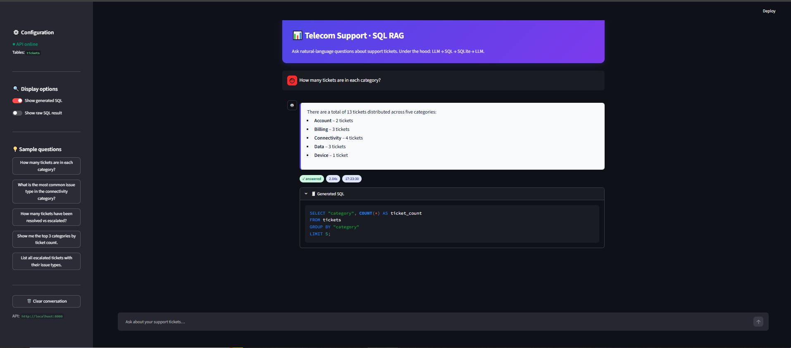

# 📊 Telecom Support · SQL RAG

Natural-language Q&A over a telecom support tickets database.

Ask questions like *"How many tickets are in each category?"* — the app translates your question into SQL, runs it against SQLite, and returns a natural-language answer. Built with **FastAPI** (backend), **Streamlit** (UI), **LangChain**, and **Groq**.

---

## ✨ Features

- 🗣️ **Natural language → SQL → answer** pipeline using Groq LLM
- 🚀 **FastAPI** backend with `/ask` and `/health` endpoints
- 🎨 **Streamlit** UI with chat history, sample questions, and SQL inspection
- 🧾 **Inspect generated SQL** and raw query results per turn
- ⚡ **Startup caching** — DB downloaded once, LLM initialized once
- 🛡️ **Error handling** — distinct states for network, HTTP, and SQL errors
- 🌗 **Theme-aware styling** — looks correct in light and dark mode

---

## Project Result


---

## 📁 Project Structure

```
SQL RAG/
├── pyproject.toml
├── .env
├── .gitignore
├── README.md
├── tickets.db              # auto-downloaded on first run
└── src/
    ├── __init__.py
    ├── main.py             # FastAPI app
    ├── config.py           # Pydantic settings
    ├── database.py         # SQLite download + SQLDatabase factory
    ├── models.py           # Pydantic request/response schemas
    ├── rag.py              # SQL RAG service
    └── app.py                  # Streamlit UI
```

---

## 🧰 Prerequisites

- Python **3.12+**
- [`uv`](https://docs.astral.sh/uv/) package manager
- A **Groq API key** → https://console.groq.com/keys

---

## ⚙️ Setup

### 1. Clone and enter the project

```bash
cd "SQL RAG"
```

### 2. Install dependencies

```bash
uv sync
```

### 3. Create your `.env`

Create a `.env` file in the project root:

```bash
GROQ_API_KEY=your_actual_groq_key_here
GROQ_MODEL=openai/gpt-oss-20b
TICKETS_URL=https://raw.githubusercontent.com/prabhu121995/sample-docs/refs/heads/main/tickets.db
TICKETS_DB_PATH=./tickets.db

# Streamlit → FastAPI
API_BASE_URL=http://localhost:8000
API_TIMEOUT=120
```

> ⚠️ Never commit `.env`. It's already in `.gitignore`.

---

## 🚀 Running the App

The app has **two services** — start them in two terminals.

### Terminal 1 — FastAPI backend

```bash
uv run uvicorn src.main:app --reload --port 8000
```

Expected startup output:

```
INFO:     Starting up SQL RAG API...
INFO:     Downloading tickets.db from https://raw.githubusercontent.com/...
INFO:     Saved tickets.db → ./tickets.db
INFO:     Ready. Tables: ['tickets']
INFO:     Uvicorn running on http://127.0.0.1:8000
```

### Terminal 2 — Streamlit UI

```bash
uv run streamlit run app.py
```

Streamlit opens **http://localhost:8501** automatically.

---

## 🧪 Testing

### Health check

```bash
curl http://localhost:8000/health
```

```json
{"status": "ok", "tables": ["tickets"]}
```

### Ask a question (curl)

**Git Bash / WSL / macOS / Linux:**

```bash
curl -X POST http://localhost:8000/ask \
  -H "Content-Type: application/json" \
  -d '{"question": "How many tickets are in each category?"}'
```

**PowerShell:**

```powershell
curl -X POST http://localhost:8000/ask -H "Content-Type: application/json" -d '{\"question\":\"How many tickets are in each category?\"}'
```

**Response:**

```json
{
  "question": "How many tickets are in each category?",
  "sql": "SELECT category, COUNT(*) AS cnt FROM tickets GROUP BY category",
  "result": "[('account', 2), ('billing', 3), ('connectivity', 4), ...]",
  "answer": "There are 2 account tickets, 3 billing tickets, 4 connectivity tickets..."
}
```

### Interactive API docs

Open **http://localhost:8000/docs** for Swagger UI.

---

## 🔌 API Reference

### `GET /health`

Returns service status and available tables.

| Field    | Type       | Description             |
| -------- | ---------- | ----------------------- |
| `status` | `string`   | `"ok"` when ready       |
| `tables` | `string[]` | Table names in the DB   |

### `POST /ask`

Answers a natural-language question.

**Request body:**

```json
{ "question": "How many tickets have been resolved?" }
```

**Response:**

| Field      | Type     | Description                       |
| ---------- | -------- | --------------------------------- |
| `question` | `string` | Echo of the input question        |
| `sql`      | `string` | SQL generated by the LLM          |
| `result`   | `string` | Raw query result from SQLite      |
| `answer`   | `string` | Natural-language answer           |

**Error codes:**

| Code | Meaning                                      |
| ---- | -------------------------------------------- |
| 400  | SQL generation or execution failed           |
| 500  | Unexpected server error                      |
| 503  | Service not ready (startup incomplete)       |

---

## 🏗️ Architecture

```
┌──────────────┐    POST /ask     ┌─────────────────┐
│  Streamlit   │ ───────────────▶ │     FastAPI    │
│   (app.py)   │ ◀─────────────── │   (src/main.py)│
└──────────────┘   JSON response  └───────┬─────────┘
                                           │
                                           ▼
                                  ┌──────────────────┐
                                  │  SQLRAGService   │
                                  │   (src/rag.py)   │
                                  └────────┬─────────┘
                                           │
                         ┌─────────────────┼─────────────────┐
                         ▼                 ▼                 ▼
                  ┌───────────┐    ┌─────────────┐    ┌──────────┐
                  │  Groq LLM │    │ SQLDatabase │    │ tickets  │
                  │ (SQL gen) │    │  (LangChain)│    │   .db    │
                  └───────────┘    └─────────────┘    └──────────┘
```

**Flow:**

1. User types a question in Streamlit.
2. Streamlit `POST /ask` to FastAPI.
3. FastAPI → `SQLRAGService.ask()`.
4. LLM generates SQL from the question + schema.
5. SQL runs against SQLite via LangChain's `SQLDatabase`.
6. LLM turns the raw result into a natural-language answer.
7. FastAPI returns `{question, sql, result, answer}`.
8. Streamlit renders it as a chat turn.

---

## 🎨 Styling Notes

### Answer card text color

Streamlit's dark theme inherits white text into custom HTML cards. The `.answer-card` CSS rule in `app.py` explicitly sets a dark color:

```css
.answer-card {
    background: #f8fafc;
    color: #0f172a;
}
.answer-card * {
    color: #0f172a !important;
}
.answer-card code {
    background: #e2e8f0;
    color: #0f172a;
}
```

### Theme-adaptive alternative

If you want the card to look right in **both** light and dark themes, replace the background with a semi-transparent tint and remove the `color`:

```css
.answer-card {
    background: rgba(79, 70, 229, 0.08);
    border-left: 4px solid #4f46e5;
    /* no color — inherits from the active theme */
}
.answer-card code {
    background: rgba(127, 127, 127, 0.18);
}
```

### Force light theme globally

Create `.streamlit/config.toml`:

```toml
[theme]
base = "light"
primaryColor = "#4f46e5"
backgroundColor = "#ffffff"
secondaryBackgroundColor = "#f1f5f9"
textColor = "#0f172a"
font = "sans serif"
```

---

## 🐛 Troubleshooting

### `Import "langchain.chains" could not be resolved`

LangChain v1.x moved `.chains` to a separate package. Install `langchain-classic` and change the import:

```bash
uv add langchain-classic
```

```python
# Old (broken on v1.x)
from langchain.chains import create_sql_query_chain

# New
from langchain_classic.chains import create_sql_query_chain
```

### `ModuleNotFoundError: No module named 'src'`

- Run uvicorn **from the project root**, not from inside `src/`.
- Ensure `src/__init__.py` exists.
- Use `src.main:app`, not `main:app`.

### `ModuleNotFoundError: No module named 'app'`

You're using the old import path. Internal imports should be:

```python
from src.database import get_sql_database
from src.models import AskRequest, AskResponse, HealthResponse
from src.rag import SQLRAGService
```

### `ValidationError: groq_api_key Field required`

`.env` isn't being read. It must live in the **current working directory** (project root). Verify:

```bash
uv run python -c "from src.config import settings; print(settings.groq_api_key[:8])"
```

### `streamlit: command not found`

Run via `uv run`:

```bash
uv run streamlit run app.py
```

### Streamlit shows old code after editing

Hard refresh: **Ctrl+F5** (Windows) or **Cmd+Shift+R** (macOS). Or run with:

```bash
uv run streamlit run app.py --server.runOnSave=true
```

### Port 8000 already in use

```bash
uv run uvicorn src.main:app --reload --port 8001
```

Then update `API_BASE_URL` in `.env` to `http://localhost:8001`.

### Answer card text is invisible (white on light)

See the **Styling Notes** section above — add `color: #0f172a` to `.answer-card`.

### HTTP 400: empty SQL

The LLM returned an empty query. `SQLRAGService._generate_sql()` retries once, then raises. If it happens often, migrate to the LCEL approach for more reliable SQL generation (see below).

---

## 🔒 Production Hardening

Before deploying publicly:

- **SQL injection**: `db.run(sql)` executes LLM-generated SQL. Use a read-only SQLite user, or validate the SQL with [`sqlglot`](https://github.com/tobymao/sqlglot) before execution.
- **CORS**: `main.py` currently has `allow_origins=["*"]`. Restrict to your Streamlit origin.
- **Auth**: add `st.login` gate or put Streamlit behind a reverse proxy with auth.
- **Rate limiting**: each `/ask` costs a Groq call. Add a token bucket or use a gateway.
- **Secrets**: use `st.secrets` in production instead of `.env`.
- **Persistence**: `st.session_state` is per-session. Use Redis or a DB for multi-user history.

---

## 🧪 Optional: LCEL Migration

To avoid `langchain-classic` entirely, replace `create_sql_query_chain` with an LCEL chain:

```python
from langchain_core.prompts import ChatPromptTemplate
from langchain_core.output_parsers import StrOutputParser

sql_prompt = ChatPromptTemplate.from_messages([
    ("system",
     "Given the database schema:\n{schema}\n\n"
     "Generate ONLY the SQL query. No explanation, no markdown fences."),
    ("human", "{question}"),
])

sql_chain = sql_prompt | llm | StrOutputParser()

sql = sql_chain.invoke({
    "schema": db.get_table_info(),
    "question": "How many tickets per category?",
})
```

This works in all LangChain versions and gives full control over the prompt.

---

## 📜 License

MIT — use it, fork it, ship it.

---

## 🙏 Credits

- [LangChain](https://python.langchain.com/) for the SQL toolkit
- [Groq](https://groq.com/) for the fast inference
- [FastAPI](https://fastapi.tiangolo.com/) + [Streamlit](https://streamlit.io/) for the stack